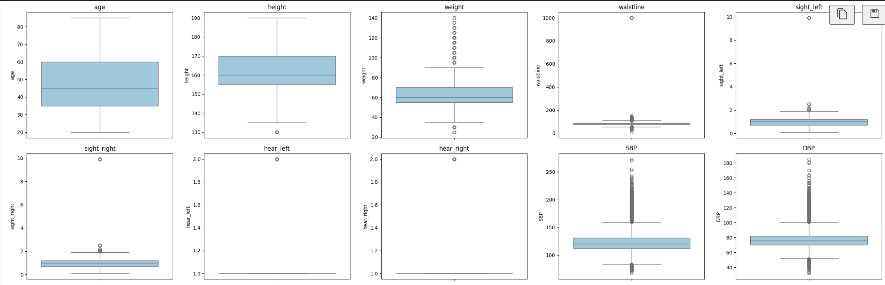
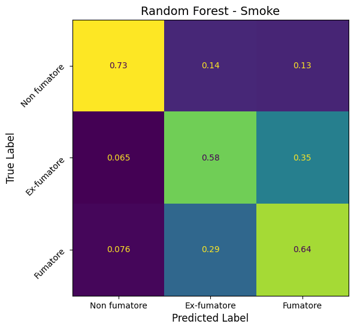
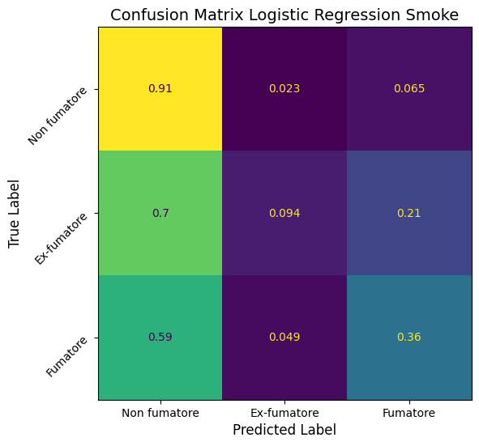
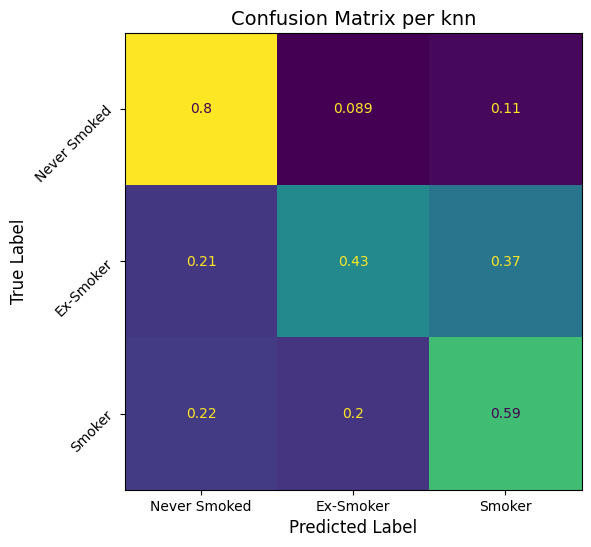
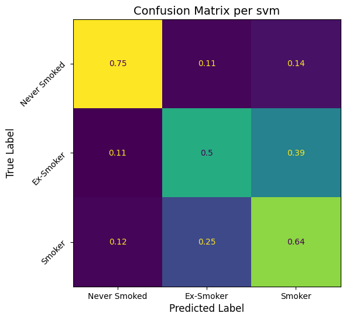
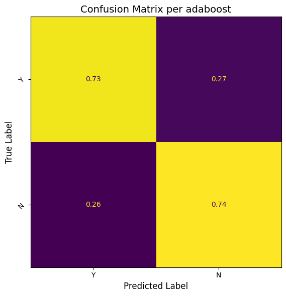
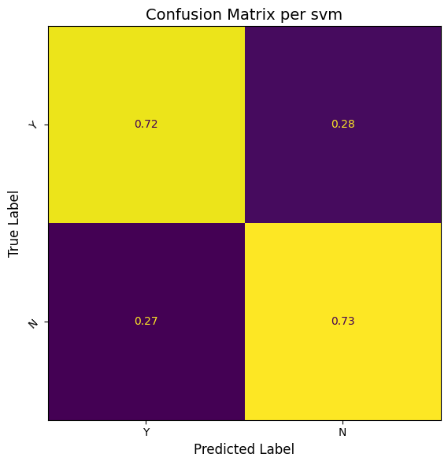
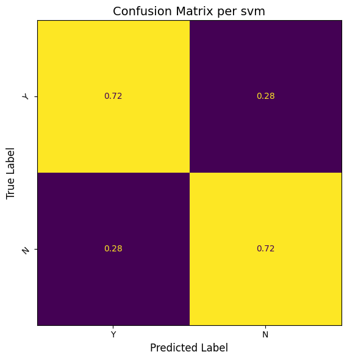
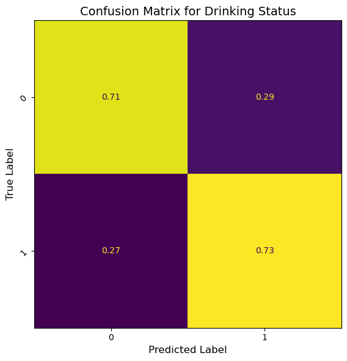

# Analisi e classificazione di abitudini di consumo di alcool e sigarette, tramite tecniche di Machine Learning

<p align="center">
<strong>Laurea magistrale in "Ingegneria e scienze informatiche"</strong><br>
<strong>Anno accademico 2024/2025</strong><br>
<strong>Corso di "Fondamenti di Machine Learning"</strong><br>
<strong>Autori:</strong><br>
Marco Deano, matricola VR503057<br>
Marco Giacopuzzi, matricola VR509643
</p>

## Indice

- **Dataset preso in analisi ed obiettivi del progetto**
- **State Of The Art**
- **Metodologie, modelli ed algoritmi utilizzati**
- **Risultati**
- **Conclusioni**
- **Biliografia**

## Dataset preso in analisi ed obiettivi del progetto

### Presentazione del dataset

Il dataset utilizzato in questo progetto[1], è un dataset tabellare composto da circa 1 milione di righe e 24 features, contenenti 
informazioni su vari parametri clinici e/o anagrafici degli individui; le features presenti includono sia dati numerici 
(misure biometriche) sia variabili categoriali (sesso).

Le label di classificazione considerate sono in tutto 2:

- **Bevitore / Non bevitore** → problema di classificazione binaria
- **Fumatore / Ex fumatore / Non fumatore** → problema di classificazione multiclasse

Il dataset presenta sbilanciamento per quanto riguarda le classi inerenti il fumo, con una distribuzione di circa 60% non fumatori, 15% ex-fumatori e 25% fumatori attuali, mentre la distribuzione delle classi inerenti il bere è bilanciata (50%-50%).

Distribuzione delle classi:
<p align="center">
    
</p>

Boxplot rappresentanti la distribuzione statistica dei valori delle varie feature:
<p align="center">
    
    
</p>

Abbiamo deciso di lavorare con questo dataset per diversi motivi: 
1. **Dimensioni del dataset e sua struttura:** essendo un dataset contenente quasi 1 milione di sample ed essendo ben strutturato con delle feature chiare ed esplicite, abbiamo ritenuto fosse adatto per simulare una situazione reale in cui viene richiesto di risolvere una task di classificazione dati dei parametri clinici di vari pazienti (per di più il dataset proviene da un sito governativo Coreano, dunque è effettivamente un dataset reale).  
Inoltre non abbiamo dovuto spendere molto tempo per comprenderne il contenuto e non si sono rese necessarie operazioni di pre-processing eccessive.   

2. **Tipologia di dataset:** entrambi crediamo che l'utilizzo delle più svariate tecniche di Machine Learning sia uno strumento molto potente da poter utilizzare nei più svariati ambiti, e uno di questi è sicuramente quello medico; proprio per questo nelle nostre ricerche per trovare il dataset da utilizzare per il progetto, abbiamo cercato per quanto possibile di riuscire a lavorare con un dataset che centrasse proprio con questo tipo di dominio.  
Anche se lo scopo principale di questo dataset non è quello di individuare la presenza o meno di una certa malattia nel corpo di un individuo, ci è sembrato interessante cercare un modello di Machine Learning che possa indicare in maniera più o meno confidente se un individuo è un fumatore, non lo è, lo era oppure se è un bevitore oppure no.  
D'altronde in un caso di ricovero di un individuo per motivi di salute, potrebbe essere importante sapere il rapporto che il paziente ha con l'alcool e con il fumo, e non è da escludere che il paziente stesso possa anche mentire o non voglia proprio rispondere a riguardo: avere a disposizione uno strumento di questo tipo che ci aiuta a rispondere a delle domande a cui il paziente può anche decidere di non rispondere o mentire, è sicuramente utile.

3. **Obiettivo del progetto non banale:** nonostente il dataset preveda per il caso del fumo di fare una classificazione con sole 3 classi e per il caso dell'alcool di fare una classificazione binaria, riteniamo che classificare un paziente come "Fumatore", "Ex-fumatore" o "Non fumatore" non sia per nulla banale; non sappiamo infatti da quanto tempo eventualmente i pazienti hanno smesso di fumare, con che frequenza fumano oppure se hanno dei parametri clinici anomali per via di altre malattie.  
Difatti, come si evincerà meglio nel proseguio del progetto, abbiamo concentrato molte delle nostre energie nel tentare di migliorare il più possibile la predizione per il caso del fumo e questo proprio perchè si è rivelata una task per nulla banale.

### Obiettivo del progetto

Come è facilamente intuibile dal paragrafo precedente, l'obiettivo principale del nostro progetto è:

- Creare un modello che cerchi di classificare correttamente il maggior numero possibile di sample sia per il caso del fumo che dell'alcool; nonostante però durante tutto lo svolgimento del progetto si sia cercato di migliorare i risultati per entrambe le task di classificazione, alla fine i nostri sforzi principali sono stati dedicati alla classificazione multiclasse del caso del fumo (per tutti i motivi descritti sopra).

Cercheremo di raggiungere questo obiettivo per step iniziando con dei modelli più semplici e proseguendo con degli altri più complessi o comunque diversi come filosofia; durante tutto lo svolgimento del progetto verranno comunque monitorati costantemente i risultati delle predizioni dei vari modelli e cercheremo di volta in volta di migliorarli sempre di più.

## State Of The Art (accenni)

L'analisi di dataset inerenti l'ambito medico e la creazione di modelli utili per la di malattie e non solo, è un tema ben studiato nell'ambito del Machine Learning.  
Attualmente, i modelli più utilizzati per problemi di classificazione in questo contesto sono sicuramente[2]:

- **Decision Tree e Random Forest:** note per la loro robustezza agli outlier e per la capacità di gestire feature categoriali e feature numeriche senza necessità di encoding e scalatura.
- **Support Vector Machine:** efficaci in scenari con alta dimensionalità, specialmente con l’uso di kernel non lineari.
- **Reti neurali:** modelli molto più complessi rispetto a quelli più tradizionali di Machine Learning, ma spesso richiedono dataset molto grandi.

Tuttavia, questi modelli non possono essere applicati senza una selezione ragionata e sensata degli iperparametri e delle feature da utilizzare e le criticità a cui si rischia di andare incontro sono:

- **Sbilanciamento delle classi:** nei dataset reali come quello preso in esame, alcune classi (es. ex-fumatori) possono essere sottorappresentate, portando a bias nei modelli.
- **Feature selection:** non tutte le feature presenti nel dataset sono necessariamente informative ed importanti per la classificazione e l’inclusione di quelle più irrilevanti può peggiorare le performance.
- **Scelta degli iperparametri:** la selezione ottimale di parametri come profondità degli alberi in Random Forest o il tipo di kernel in SVM o ancora il numero di "neighbours" in modelli tipo K-NN, influisce significativamente sulla qualità del modello.

## Metodologie, modelli ed algoritmi utilizzati

Per raggiungere gli obiettivi che ci siamo prefissati, abbiamo eseguito in un ordine ben preciso determinati step che verranno descritti di seguito; durante tutti i test effettuati i risultati e le performance dei vari modelli/teniche utilizzate, sono stati monitorati tenendo in considerazione le classiche metriche di `Accuratezza`, `Precisione`, `Recall` ed `F1-score` ma dando più importanza all'`Accuratezza` per il caso della classificazione binaria dell'acool e all'`F1-score` per il caso della classificazione multiclasse del fumo. Quest'ultima scelta è stata fatta perchè l'F1-score risulta essere una metrica particolarmente utile nei problemi di classificazione multiclasse sbilanciata perché fornisce un bilanciamento tra precision e recall; inoltre evita che un modello sembri performante solo perché predice bene la classe più rappresentata e quindi un buon F1-score indica che il modello non solo riconosce le classi meno rappresentate, ma lo fa anche in modo preciso.  Oltre ciò, si è rivelato essenziale durante tutto il progetto l'utilizzo e la visualizzazione delle `Confusion Matrix`.

Come si evincerà di seguito, nel nostro progetto abbiamo testato modelli di Machine Learning diversi cercando di valutare quale fosse più adatto al nostro problema di classificazione; ovviamente non ci siamo limitati a testare semplicemente i modelli base, ma abbiamo accompagnato ogni fase con diverse tecniche per migliorare la qualità dei dati da presentare in input ai modelli e ottimizzare le prestazioni dei modelli stessi. Abbiamo quindi adottato, a seconda anche del modello con cui stavamo lavorando, le seguenti tecniche: 

- **Feature selection:** per ridurre la dimensionalità del dataset e migliorare l'efficienza dei modelli.
- **Feature engeneering:** parallelamente alla feature selection, abbiamo anche cercato di creare, trasformare ed in generale ottimizzare le feature del dataset per migliorare le performance dei nostri modelli; più nel dettaglio abbiamo fatto delle ricerche inerenti il dominio di cui ci siamo occupati in questo progetto e abbiamo creato delle nuove feature in modo da ottenere un dataset con dei parametri differenti da quelli che avevamo a disposizione all'inizio e tutto ciò ovviamente con l'obiettivo di cercare di migliorare le performance dei nostri modelli predittivi.
- **Ottimizzazione degli iperparametri:** tramite "Grid Search" sono stati testati i vari modelli con combinazioni di iperparametri differenti, con l'obiettivo di trovare quella che più si adatta al nostro problema.
- **Principal Component Analysis:** per ridurre la dimensionalità mantenendo la maggior parte della varianza, per molti modelli predittivi risulta sempre utile apllicare la PCA.
- **Tecniche di ensemble prediction:** spesso utilizzare solo un modello per fare predizioni su un dataset molto grande, non è la scelta migliore ed il rischio è che vengano fatte predizioni corrette per certe classi e per altre meno; proprio per questo sfrutteremo tecniche di ensemble prediction (come bagging, boosting e stacking) per cercare di predirre in maniera più robusta le classi dei vari sample.
- **Classificazione gerarchica:** un ulteriore passo è stato l’introduzione di una strategia di classificazione gerarchica, particolarmente utile per gestire il problema dell’imbalanciamento delle classi soprattutto per la task sul fumo.

### Preprocessing e pulizia del dataset

Prima di applicare qualsiasi modello di Machine Learning, è fondamentale preparare il dataset in modo che si possano sfruttare al meglio le potenzialità dei vari modelli di apprendimento; abbiamo dunque nell'ordine:  

1. Fatto una prima analisi dettagliata del dataset protagonista del progetto di Machine Learning ed estrapolato quindi tutte le informazioni utili per comprenderne la struttura; più nello specifico abbiamo ricavato, tramite dei semplici script, la distribuzione dei valori per le varie feature, la distribuzione delle classi in tutto il dataset e tracciato dei "boxplot" per individuare la presenza di eventuali outlier che possono interferire con il training dei vari modelli che verranno utilizzati nel progetto.
2. Identificato i valori fuori scala (outlier): l'analisi dettagliata del dataset fatta al passo precedente, ci ha permesso di individuare facilmente molti degli outlier più evidenti (che presentavano valori estremamente distanti dalla media, es: waistline = 999) ed eliminarli dal dataset, ma ci ha anche spinti ad utilizzare uno strumento statistico per individuare gli outlier un po' meno evidenti ma comunque anomali rispetto alla distribuzione generale del dataset. A tale scopo abbiamo utilizzato lo Z-score[3]: una misura statistica che indica di quante deviazioni standard un valore di una feature si discosta dalla media; per definire la soglia di esclusione dei sample, abbiamo stabilito un valore limite di Z-score pari a 5, oltre il quale i campioni vengono considerati anomali ed esclusi dal dataset. In questo modo abbiamo escluso da tutte le operazioni di predizione future, tutti quei sample che o hanno valori errati oppure rappresentano casi clinici particolari che andrebbero ad influire negativamente sui risultati del progetto.
3. Fatto encoding delle variabili categoriali: più nel dettaglio Label Encoding (non si è reso necessario il One-Hot Encoding visto che le uniche feature categoriali sono "sex" e le label delle classi). 

Abbiamo concordato, terminati questi passaggi, non fosse necessario eseguire subito uno scaling dei dati (visto che sono presenti features con valori molto grandi e altre con valori più piccoli), perchè abbiamo ritenuto essere più opportuno fare queste operazioni eventualmente in un secondo momento a seconda dei modelli di Machine Learning che avremmo utilizzato.

Inoltre, nonostante avessimo inizialmente pensato di utilizzare le ground truth dello smoke come feature per la classificazione del drink (e viceversa), abbiamo deciso di abbandonare questa strategia dopo aver effettuato alcuni test preliminari, in quanto l'inclusione di queste non aveva portato a un miglioramento delle performance dei modelli.

#### Script e notebook di riferimento:
- `load_data_and_distribution_analisys.py`
- `distribution_analisys_and_outlier_remove.ipynb`

### Un primo esempio con un modello semplice

Una volta terminata la fase di analisi e pulizia dei dati, abbiamo testato un modello base, utilizzando un classificatore semplice come un `Logistic Regressor`, per ottenere un primo benchmark sulle performance e dopo aver analizzato questi primissimi risultati, abbiamo gradualmente introdotto modelli più complessi e implementato diverse tecniche di ottimizzazione per migliorare le prestazioni.

### Random Forest

Il modello che si è rivelato il migliore per quanto rifuarda la task di classificare correttamente le classi del nostro dataset, è stato proprio il primo che abbiamo testato: la Random Forest. Sapevamo che questo fosse un modello molto diffuso e adatto all'ambito medico, ma non avremmo pensato che ci avrebbe fatto ottenere risultati migliori anche di modelli come SVM non lineari o tecniche come il Boosting, il Bagging e lo Stacking (il perchè lo abbiamo ritenuto il miglior modello per il nostro progetto, lo riportiamo nella parte di conclusioni e risultati finali).

Abbiamo inizialmente testato un modello base di Random Forest, senza esplicitare i valori dei vari iperparametri, per ottenere dei primi risultati di riferimento e comprendere il comportamento del modello sui nostri dati; dopo aver valutato le metriche di performance, ci siamo resi conto che c'erano margini di miglioramento e abbiamo deciso di affinare il modello seguendo un approccio progressivo.

Per prima cosa, abbiamo proceduto con un’ottimizzazione degli iperparametri sfruttando una "Grid Search" per affinare ulteriormente la ricerca; tra i parametri più rilevanti abbiamo considerato il numero di alberi nella foresta, la profondità massima degli alberi e il numero minimo di campioni richiesti per effettuare uno split dei nodi, tenendo sempre monitorati tutte le metriche citate prima ma prestando particolare attenzione all'F1-score. Ci siamo subito accorti che, solo facendo una ricerca degli iperparametri ottimali, le metriche cominciavano a migliorare e la confusion matrix diventava sempre più bilanciata, con una riduzione degli errori di classificazione soprattutto nelle classi meno rappresentate; inoltre la confusion matrix ci ha permesso di individuare quali classi venivano maggiormente confuse tra loro, aiutandoci a comprendere dove il modello faticava maggiormente

A questo punto, abbiamo provato ad ottimizzare la RandomForest sfruttando la tecnica della feature selection: avendo a che fare con un modello predittivo di questo tipo, ovvero abbastanza robusto alle feature irrilevanti, non ci aspettavamo un grosso miglioramento delle performance ma nonostante ciò rimane comunque un passaggio utile per poter eventualmente semplificare il modello andando a togliere anche poche feature e rendere il modello predittivo più veloce. Inoltre, non è stato indicato a priori un numero fissato di feature da selezionare, in quanto non certi di quelle che potessero essere le performance selezionando solo il 10%, il 20%, il 50%, il 75%... delle feature; quindi abbiamo implementato un algoritmo di feature selection di tipo Forward, monitorando la F1-score ad ogni "best_feature" aggiunta, e salvando la combinazione di feature migliore tra tutte quelle testate.

Per validare ulteriormente il nostro approccio, abbiamo infine applicato la cross-validation utilizzando la tecnica `StratifiedKFold`, in modo da avere una valutazione più affidabile delle performance su diverse suddivisioni del dataset: siccome nello step precedente in cui abbiamo effettuato feature selection abbiamo allenato il nostro modello tenendo costante il set di train e di validazione, potremmo aver "overfittato" in base alla suddivisione specifica; con la cross-validation, testiamo il modello su diverse porzioni del dataset e possiamo valutare se le feature scelte hanno migliorato davvero il modello.

Dopo tutte queste analisi, la Random Forest si è dimostrata un modello solido, in grado di ottenere buoni risultati con un tempo di addestramento contenuto; inoltre, come si è potuto evincere, non si sono rese necessarie operazioni come Scaling dei dati o Dimensionality Reduction e questo perchè il modello Random Forest non è influenzato da grandezze diverse tra le feature e gestisce bene dati ad alta dimensionalità.

#### Valori selezionati per gli iperparametri:

- n_estimators=100 
- max_depth=20 
- min_samples_split=50

#### Notebook di riferimento:

- `random_forest_classifier_base_model.ipynb`
- `random_forest_classifier_with_feature_selection.ipynb`
- `random_forest_classifier_cross_validation.ipynb`

### Altri classificatori

Ovviamente non ci siamo limitati ad utilizzare ed ottimizzare solamente il modello di Random Forest, anzi abbiamo effettuato le stesse procedure fatte per tale modello anche con modelli totalmente differenti come filosofia; nel progetto non sono stati riportati tutti questi passaggi anche per questi modelli per non appesantire troppo il progetto, però abbiamo comunque riportato tutti i risultati per mettere in evidenza le differenze di performance tra i vari approcci e giustificare le scelte effettuate. 
I modelli allenati e testati sono stati:

- **KNN:** rappresenta un metodo basato sulla similarità tra i dati, il che ci ha permesso di analizzare il comportamento del modello quando la decisione dipende strettamente dalla vicinanza ai punti nel dataset; questo modello è sicuramente utile perchè non ha bisogno di nessun tipo di assunzione per quanto riguarda i dati e permette di costruire dei "bound" tra le classi di tipo non lineare e di conseguenza permette di capire se le classi siano separabili nello spazio delle feature a disposizione.
- **AdaBoost (con base_estimator Albero Decisionale):** un modello di ensemble basato sul boosting e noto per la sua capacità di concentrarsi sugli errori commessi dai modelli più deboli nelle iterazioni precedenti, migliorando progressivamente la qualità della classificazione; abbiamo deciso di testare anche questo tipo di "modello" in modo da verificare se un metodo di ensemble focalizzato su un raffinamento iterativo potesse fornire risultati migliori rispetto a un metodo più stabile come Random Forest.
- **Support Vector Machine (kernel lineare):** è un modello molto efficace nei problemi di classificazione, in particolare quando i dati sono ben separabili in uno spazio ad alta dimensione; nonostante sapessimo che difficilmente i sample del nostro dataset lo sarebbero stati, abbiamo deciso di testare anche questo tipo di modello per verificare empiricamente se una SVM con kernel lineare potesse comunque individuare un iperpiano di separazione efficace, magari grazie all’uso di margini ampi e alla capacità di gestire outlier con il parametro di penalizzazione.

Ovviamente prima di allenare questi modelli, ci siamo assicurati di normalizzare i dati di train e test per ottenere le migliori performance possibili.

Oltre a testare questi modelli nella loro versione base e con iperparametri ottimi, abbiamo anche testato l'applicazione di PCA come tecnica di Dimensionality Reduction (ovviamente solo per il modello KNN ed il modello SVM, per il modello AdaBoost con base_estimator Albero Decisionale abbiamo ritenuto fosse non necessario): difatto avendo a che fare con un dataset con 22 feature e avendo gia testato la tecnica della feature selection, volevamo valutare se la riduzione della dimensionalità tramite PCA potesse migliorare le prestazioni dei modelli.  Anche per quanto riguarda l'utilizzo di questa tecnica con i modelli sopra citati, non abbiamo creato un notebook contenente tutti i passaggi per selezionare il miglior numero di componenti da passare come parametro alla PCA, ma abbiamo lasciato solamente la versione che ci ha permesso di ottenere i migliori risultati.

#### Valori selezionati per gli iperparametri:

- AdaBoostClassifier(n_estimators=200)
- LinearSVC(C=0.1)
- KNeighborsClassifier(n_neighbors=500)

#### Notebook di riferimento:

- `other_classifiers.ipynb`
- `other_classifiers_with_pca.ipynb`

### Feature engeneering

Una volta testati tutti questi modelli predittivi di Machine Learning, abbiamo fatto delle ricerche inerenti il dominio di cui ci siamo occupati in questo progetto e abbiamo creato delle nuove feature in modo da creare un dataset con dei parametri differenti da quelli che avevamo a disposizione all'inizio; ovviamente l'obiettivo di tutto ciò è stato cercare di migliorare le performance dei nostri modelli predittivi estraendo informazioni più significative dalle feature esistenti o crearne di nuove che potessero contribuire a migliorare le performance dei classificatori.  

#### Caratteristiche antropometriche

Queste caratteristiche offrono buoni indicatori circa lo stato fisico di un paziente, elementi che possono essere influenzati dal fumo e dal consumo di alcol.
L'obesità e la distribuzione anomala del grasso sono condizioni che sono spesso correlate a comportamenti a rischio e possono essere identificate utilizzando questi parametri.

- **BMI**: Misura l'obesità generale.
- **wth_ratio**: Rapporto vita/altezza, indica l'obesità addominale.
- **wtw_ratio**: Rapporto vita/peso, evidenzia la distribuzione del grasso.
- **obesity_flag**: Flag per identificare rapidamente l'obesità.

#### Caratteristiche Cardiovascolari

Le caratteristiche cardiovascolari offrono indicazioni chiave sullo stato del sistema circolatorio, il quale può essere compromesso dal fumo e dal consumo di alcol.
Questi parametri evidenziano anomalie pressorie e rigidità arteriosa, segnali indiretti di comportamenti a rischio.

- **pulse_pressure**: Differenza tra SBP e DBP, indice di rigidità arteriosa.
- **MAP**: Misura globale della pressione arteriosa.
- **bp_category**: Classifica la pressione, rilevando eventuali anomalie.

#### Profilo Lipidico e Rapporti Metabolici

Queste caratteristiche metaboliche forniscono informazioni utili sullo stato cardiovascolare e metabolico dei pazienti.
Forniscono anche informazioni sul modo in cui il fumo e il consumo di alcol possono alterare queste caratteristiche.
Di conseguenza, un profilo lipidico instabile e un disequilibrio nei rapporti metabolici possono essere indicazioni indirette di un modo in cui uno vive uno stile di vita malsano.

- **TC_HDL_ratio**: Indica il rischio cardiovascolare confrontando il colesterolo totale con l'HDL.
- **LDL_HDL_ratio**: Evidenzia lo squilibrio tra il colesterolo “cattivo” e quello “buono”.
- **non_HDL_chole**: Misura le particelle aterogeniche, segnale di potenziali patologie.
- **triglyceride_hdl_ratio**: Riflette il rischio metabolico influenzato da dieta e stile di vita.
- **AIP**: Valuta sinteticamente il rischio cardiovascolare tramite il logaritmo di trigliceridi/HDL.
- **TyG**: Indica resistenza insulinica e rischio metabolico calcolando trigliceridi e glucosio.

#### Funzione Epatica e Renale[4]

L'inclusione di indicatori per la funzione epatica e renale è vantaggiosa perché cambiamenti in questi parametri possono essere segnali indiretti di danni organici causati dal fumo e dal consumo di alcol.
Queste azioni aiutano a identificare stili di vita a rischio fornendo informazioni sullo stato degli organi.

- **AST_ALT_ratio**: Valori elevati possono indicare danni epatici da alcol.
- **liver_enzyme_interaction**: Segnala anomalie enzimatiche legate all'abuso di alcol.
- **liver_enzyme_avg**: Fornisce una panoramica rapida della funzione del fegato.
- **eGFR**: Utile per rilevare danni renali associati a stili di vita non salutari.

Visto che tramite l'aggiunta di queste nuove feature abbiamo incrementato la dimensionalità del dataset, abbiamo ritenuto opportuno fare dei test applicando anche la tecnica della PCA; c'è da precisare che abbiamo testato solo questa tecnica e non la Feature Reduction dopo l'aggiunta di queste nuove feature, per una questione di tempo per ottenere i risultati.  Abbiamo ritenuto che l'utilizzo della PCA fosse un test necessario da fare per provare ad estrarre pattern più significativivisto visto che tramite feature engeneering abbiamo aumentato il numero delle feature totali all'interno del dataset.

#### Notebook di riferimento:

- `feature_engeneering.ipynb`
- `feature_engeneering_with_pca.ipynb`

### Bagging ensemble

Arrivati a questo punto del progetto non ci rimanevano molti modelli/tecniche da provare per migliorare i risultati già ottenuti, quindi una delle ultime tecniche di predizione che abbiamo testato è stata quella del bagging ensemble: una tecnica che consiste nel combinare i risultati ottenuti da più modelli per ottenere una predizione più accurata. I modelli che abbiamo utilizzato per fare bagging ensemble, sono stati AdaBoost e Support Vector Machine (kernel rbf), abbiamo scelto questi 2 modelli per le seguenti ragioni:

- Volevamo provare a fondere la tecnica del boosting (caratteristica di AdaBoost) con la tecnica del bagging ensemble
- Siccome il tempo per il training di un modello di SVM non lineare scala in maniera quadratica con il numero di sample, era proibitivo allenare un modello singolo di questo tipo anche solo utilizzando il 50% del dataset (500.000 sample); dunque abbiamo optato per utilizzare la tecnica dell'ensemble utilizzando più modelli SVM non lineari ma allenati ognuno su una porzione ristretta del dataset.

Non abbiamo testato la tecnica del bagging ensemble per altri modelli come Random Forest perchè secondo il nostro parere non avrebbe apportato un beneficio significativo: nel caso della Random Forest il bagging è già un componente fondamentale del modello stesso in cui vengono costruiti più alberi su sottocampioni del dataset e poi aggregati tramite voto maggioritario, mentre per quanto riguarda KNN, il bagging non risulta particolarmente efficace perchè il suo comportamento dipende essenzialmente dalla scelta dei vicini più prossimi e dalla distanza utilizzata.

#### Valori selezionati per gli iperparametri:

- BaggingClassifier(estimator=SVC(kernel='rbf', C=1), n_estimators=30, max_samples=0.1)
- BaggingClassifier(estimator=AdaBoostClassifier(n_estimators=50), n_estimators=100)

#### Notebook di riferimento:

- `bagging_ensemble.ipynb`

### Stacking Classifier e Voting Classifier

Altre 2 tecniche di ensemble che abbiamo testato, sono state lo Stacking e il Voting Classifier: entrambi i metodi mirano a combinare più modelli per ottenere una predizione finale più robusta come nel caso del bagging e del boosting, ma con approcci differenti.

- Lo Stacking sfrutta un livello aggiuntivo di apprendimento rispetto al bagging, in quanto i risultati dei singoli modelli base utilizzati vengono sfruttati come input per un meta-modello, che impara a combinare le loro predizioni in modo ottimale; abbiamo selezionato come modelli base tutti quelli che abbiamo sfruttato nei test precedenti (escluso il SVM lineare) e abbiamo utilizzato come meta-modello un SVM con kernel lineare.  Questa scelta è stata fatta per un motivo semplice: il modello Random Forest fino a questo momento è risultato il migliore e abbiamo pensato innanzitutto che fosse corretto sfruttarlo come modello base all'interno dello stacking piuttosto che come meta-modello finale e che fosse invece sbagliato inserirlo sia come modello base che come meta-modello, perchè avrebbe ridotto la diversità del sistema di ensemble. La scelta del meta-modello è dunque ricaduta sul SVM lineare vista la sua velocità di training e i comunque buoni risultati che ci aveva garantito fino a questo punto del progetto.
- Il Voting Classifier, invece, segue un approccio più semplice: aggrega le predizioni dei vari modelli base attraverso una strategia di voto, che può essere di tipo hard voting (sceglie la classe con più voti tra i modelli) o soft voting (media delle probabilità predette).

#### Notebook di riferimento:

- `model_stacking.ipynb`

### Classificatore gerarchico

Arrivati a questo punto del progetto, ci siamo resi conto che l'obiettivo di separare in maniera sempre più precisa la classe dei Fumatori da quella degli Ex-fumatori e da quella dei Non-fumatori risultava particolarmente complesso a causa dello sbilanciamento delle classi e della possibile sovrapposizione nei pattern dei dati; ci siamo accorti però che tutti i modelli allenati e perfezionati fino ad ora, avevano una cosa in comune: non riuscivano a separare correttamente la classe degli Ex-fumatori da quella dei Fumatori. Facendo poi un'analisi ancora più approfondita dei risultati, in particol modo delle matrici dei confusione ottenute, ci siamo però accorti che uno dei modelli testati nel progetto riusciva piuttosto bene a non classificare i Non Fumatori rispetto ai Fumatori o Ex-fumatori: si tratta del modello Random Forest. 

<p align="center">
    
</p>

Abbiamo quindi deciso di fare un ultimo tentativo per cercare di migliorare i risultati ottenuti fino a questo punto del progetto, sperimentando un approccio gerarchico alla classificazione e suddividento il problema in 2 fasi distinte:

- `Primo classificatore:` un modello iniziale per distinguere tra Non-fumatori e la classe unificata Ex-fumatori + Fumatori.
- `Secondo classificatore:` un modello specifico addestrato per separare i campioni precedentemente classificati come Ex-fumatori + Fumatori, suddividendoli nelle due classi originali.

L'idea alla base di questa strategia è che venga allenato un primo modello in modo che possa distinguere chi non ha mai fumato da chi, invece, ha avuto un'esposizione al fumo e successivamente venga allenato un secondo classificatore che può invece concentrarsi sulla separazione tra Ex-fumatori e Fumatori attuali, che presentano differenze più sottili e meno evidenti rispetto alla distinzione con i Non-fumatori.  Abbiamo dunque fatto una ricerca su quello che potesse essere un primo modello ottimale che potesse distinguere la classe dei Non-fumatori e la classe unificata Ex-fumatori + Fumatori e di seguito una ricerca analoga per selezionare il secondo modello. I nostri test hanno evidenziato come il miglior modello per riuscire a separare i Non-fumatori dalla classe unificata Ex-fumatori + Fumatori è lo Stacking Classifier, mentre per quanto riguarda il secondo modello il migliore i grado di separare Ex-fumatori e Fumatori è la Random Forest (anche lo Stacking Classifier si avvicina molto come performance).

Nonostante l'idea di partenza ci sembrasse buona, ci siamo però accorti di quanto non fosse banale costruire un classificatore di questo tipo: il fatto che il primo modello potesse classificare erroneamente dei sample con label "Non-fumatore" come "Ex-fumatore o Fumatore" e che poi dovessere essere classificati come "Ex-fumatore" o "Fumatore" ci ha creato dei grossi problemi nella creazione del modello che avevamo in mente noi. Difatti alla fine siamo stati costretti ad allenare il secondo modello con tutte e 3 le label iniziali e non solo sulle label di "Ex-fumatore" e "Fumatore" come avevamo in mente all'inizio.  Un'altra alternativa che ci era venuta in mente, è stata quella di allenare due modelli totalmente separati (il primo con label "Non-fumatore" e "Ex-fumatore o Fumatore" ed il secondo con label "Ex-fumatore" e "Fumatore") con una porzione del dataset, e in un secondo momento utilizzare il restante dataset come test; non abbiamo implementato questa alternativa per il semplice motivo che non sarebbe stato possibile avere dei risultati direttamente comparabili con quelli ottenuti fino a questo punto.

#### Notebook di riferimento:

- `separation_smokers_non_smokers.ipynb`
- `separation_ex_smokers_non_smokers.ipynb`
- `multistep_smokers_test.ipynb`

### Visualizzazione dati tramite t-SNE

Per farci un'idea più generale di quello che potesse essere la distribuzione nello spazio dei dati presenti nel dataset, abbiamo anche sfruttato la tecnica di t-SNE; in questo modo abbiamo potuto visualizzare quanto effettivamente le classi del nostro dataset fossero sovrapposte tra di loro. Ovviamente per rendere il tutto più comprensibile, abbiamo "plottato" il tutto in uno spazio a 2 dimensioni e considerando in un primo test le label "Non-fumatore" e "Ex-fumatore o Fumatore" accorpate in una unica classe ed in un secondo test le classi "Ex-fumatore" e "Fumatore".

#### Notebook di riferimento:

- `data_visualization.ipynb`

## Risultati

In questa sezione vengono riportati i risultati ottenuti dai vari modelli di classificazione testati, confrontando le loro performance attraverso le metriche citate nella sezione relativa agli obiettivi del progetto e vengono inoltre riportate le confusion matrix per comprendere meglio come mai certi modelli risultano essere migliori di altri secondo noi.

### Modello semplice Logistic Regression

I risultati ottenuti grazie a questo modello, ci permetto di avere un punto di partenza per poter poi confrontare le prestazioni con quelle dei modelli allenati successivamente.

#### Smoke

Metriche:
```python
              precision    recall  f1-score   support

         1.0       0.69      0.91      0.79    167528
         2.0       0.40      0.09      0.15     47377
         3.0       0.50      0.36      0.42     58574

    accuracy                           0.65    273479
   macro avg       0.53      0.45      0.45    273479
weighted avg       0.60      0.65      0.60    273479
```

Confusion matrix:
<p align="center">
    
</p>

#### Drink

Metriche:
```python
              precision    recall  f1-score   support

           0       0.70      0.70      0.70    135539
           1       0.71      0.70      0.70    137940

    accuracy                           0.70    273479
   macro avg       0.70      0.70      0.70    273479
weighted avg       0.70      0.70      0.70    273479
```

Confusion matrix:
<p align="center">
    
</p>

### Random Forest

Di seguito verranno invece riportati i risultati per quanto riguarda quello che abbiamo categorizzato come il miglior modello tra tutti quelli testati: la Random Forest; come si potrà evincere infatti, oltre ad avere la F1-score e l'accuratezza tra le più alte tra tutti i modelli testati, è anche il modello che riesce meglio a separare la classe dei "Non fumatori" dalla classe combinata "Fumatori e Ex-fumatori" e a sua volta è anche la migliore che riesce a separare queste ultime due (anche se comunque non in maniera ottimale). Per di più, proprio grazie a questi risultati ottenuti dalla Random Forest abbiamo avuto l'idea di testare un classificatore di tipo gerarchico, dunque si è rivelato un modello fondamentale per il nostro progetto.

#### Smoke (modello base)

Metriche:
```python
              precision    recall  f1-score   support

         1.0       0.82      0.84      0.83    167528
         2.0       0.44      0.35      0.39     47377
         3.0       0.51      0.56      0.54     58574

    accuracy                           0.69    273479
   macro avg       0.59      0.58      0.58    273479
weighted avg       0.69      0.69      0.69    273479
```

Confusion matrix:
<p align="center">
    
</p>

#### Drink (modello base)

Metriche:
```python
              precision    recall  f1-score   support

           0       0.72      0.71      0.72    135539
           1       0.72      0.73      0.73    137940

    accuracy                           0.72    273479
   macro avg       0.72      0.72      0.72    273479
weighted avg       0.72      0.72      0.72    273479
```

Confusion matrix:
<p align="center">
    
</p>

#### Smoke (modello ottimizzato con iperparametri ottimi e feature selection)

Metriche:
```python
              precision    recall  f1-score   support

Non fumatore       0.94      0.73      0.82    179990
 Ex-fumatore       0.41      0.58      0.48     52103
    Fumatore       0.49      0.64      0.55     63429

    accuracy                           0.68    295522
   macro avg       0.61      0.65      0.62    295522
weighted avg       0.75      0.68      0.70    295522
```

Confusion matrix:
<p align="center">
    
</p>

#### Drink (modello ottimizzato con iperparametri ottimi e feature selection)

Metriche:
```python
              precision    recall  f1-score   support

           Y       0.74      0.71      0.73    147869
           N       0.72      0.75      0.74    147653

    accuracy                           0.73    295522
   macro avg       0.73      0.73      0.73    295522
weighted avg       0.73      0.73      0.73    295522
```

Confusion matrix:
<p align="center">
    
</p>

#### Cross validation

Siccome la Random Forest si è rivelato il modello migliore in assoluto, abbiamo anche pensato di fare cross-validation per valutare in maniera più precisa le performance del modello; siccome nello step della feature selection abbiamo allenato il nostro modello tenendo però costante il set di train e di validazione, potremmo aver "overfittato" in base alla suddivisione specifica, quindi con la cross-validation, abbiamo testato il modello su diverse porzioni del dataset per poter valutare in maniera esaustiva il modello.
Specifichiamo che avremmo potuto effettuare la cross-validation anche per tutti gli altri modelli, ma vista la quantità di modelli testati ed il tempo necessario per compiere cross-validation ci siamo limitati a farla solo per il modello migliore tra tutti quelli testati.

### Altri modelli (SVM lineare, KNN, AdaBoost)

Per poter confrontare i risultati della Random Forest con tutti gli altri modelli testati, riportiamo anche i risultati di questi appena citati; come si potrà evincere, qualche modello (come SVM) si avvicina molto alle performance della Random Forest ma risulta comunque leggermente peggiore, mentre per altri modelli si noterà marcatamente la differenza non tanto di metriche come la F1-score quanto della capacità di classificare i sample appartenenti agli "Ex-fumatori" e "Fumatori". Purtroppo per quanto riguarda la classificazione riguardante il consumo di alcool, da adesso in poi rimarrà praticamente la medesima.

#### AdaBoost (smoke)

Metriche:
```python
              precision    recall  f1-score   support

         1.0       0.83      0.83      0.83    119747
         2.0       0.45      0.32      0.37     34738
         3.0       0.50      0.63      0.56     42530

    accuracy                           0.70    197015
   macro avg       0.59      0.59      0.59    197015
weighted avg       0.69      0.70      0.69    197015
```

Confusion matrix:
<p align="center">
    
</p>

#### SVM (smoke)

Metriche:
```python
Classification report per svm:
              precision    recall  f1-score   support

         1.0       0.94      0.73      0.82    119747
         2.0       0.41      0.55      0.47     34738
         3.0       0.47      0.65      0.55     42530

    accuracy                           0.68    197015
   macro avg       0.61      0.64      0.61    197015
weighted avg       0.75      0.68      0.70    197015
```

Confusion matrix:
<p align="center">
    
</p>

#### KNN (smoke)

Metriche:
```python
              precision    recall  f1-score   support

         1.0       0.85      0.80      0.83    119747
         2.0       0.44      0.43      0.43     34738
         3.0       0.49      0.59      0.54     42530

    accuracy                           0.69    197015
   macro avg       0.60      0.61      0.60    197015
weighted avg       0.70      0.69      0.70    197015
```

Confusion matrix:
<p align="center">
    
</p>

#### AdaBoost (drink)

Metriche:
```python
              precision    recall  f1-score   support

           0       0.73      0.73      0.73     98396
           1       0.73      0.73      0.73     98619

    accuracy                           0.73    197015
   macro avg       0.73      0.73      0.73    197015
weighted avg       0.73      0.73      0.73    197015
```

Confusion matrix:
<p align="center">
    
</p>

#### SVM (drink)

Metriche:
```python
              precision    recall  f1-score   support

           0       0.72      0.72      0.72     98396
           1       0.72      0.72      0.72     98619

    accuracy                           0.72    197015
   macro avg       0.72      0.72      0.72    197015
weighted avg       0.72      0.72      0.72    197015
```

Confusion matrix:
<p align="center">
    
</p>

#### KNN (drink)

Metriche:
```python
              precision    recall  f1-score   support

           0       0.73      0.67      0.70     98396
           1       0.70      0.76      0.73     98619

    accuracy                           0.71    197015
   macro avg       0.72      0.71      0.71    197015
weighted avg       0.72      0.71      0.71    197015
```

Confusion matrix:
<p align="center">
    
</p>

### Altri modelli con PCA (SVM lineare, KNN)

Come già accennato nella sezione precedente, abbiamo anche testato l'utilizzo della PCA per quanto riguarda i modelli KNN e SVM; purtroppo i risultati non hanno portato a dei miglioramenti.

#### SVM (smoke)

Metriche:
```python
              precision    recall  f1-score   support

         1.0       0.91      0.75      0.82    119747
         2.0       0.42      0.50      0.46     34738
         3.0       0.47      0.64      0.54     42530

    accuracy                           0.68    197015
   macro avg       0.60      0.63      0.61    197015
weighted avg       0.73      0.68      0.70    197015
```

Confusion matrix:
<p align="center">
    
</p>

#### KNN (smoke)

Metriche:
```python
              precision    recall  f1-score   support

         1.0       0.85      0.81      0.83    119747
         2.0       0.44      0.41      0.42     34738
         3.0       0.49      0.58      0.53     42530

    accuracy                           0.69    197015
   macro avg       0.59      0.60      0.59    197015
weighted avg       0.70      0.69      0.69    197015
```

Confusion matrix:
<p align="center">
    
</p>

#### SVM (drink)

Metriche:
```python
              precision    recall  f1-score   support

           0       0.71      0.72      0.71     98396
           1       0.72      0.71      0.71     98619

    accuracy                           0.71    197015
   macro avg       0.71      0.71      0.71    197015
weighted avg       0.71      0.71      0.71    197015
```

Confusion matrix:
<p align="center">
    
</p>

#### KNN (drink)

Metriche:
```python
              precision    recall  f1-score   support

           0       0.73      0.67      0.70     98396
           1       0.70      0.75      0.72     98619

    accuracy                           0.71    197015
   macro avg       0.72      0.71      0.71    197015
weighted avg       0.72      0.71      0.71    197015
```

Confusion matrix:
<p align="center">
    
</p>

### Feature Engeneering (Random Forest, AdaBoost, SVM lineare, KNN)

Il tentativo di fare feature engeneering, è stato un test che non sapevamo se ed eventualmente in che misura avrebbe influito sui risultati; noi ci siamo limitato ad aggregare le nuove feature ricavate a quelle già esistenti e sicuramente avremmo potuto fare delle prove differenti, per esempio utilizzando solo le nuove feature, oppure facendo feature selection, oppure ancora facendo delle trasformazioni differenti da quelle attuate da noi. Purtroppo anche in questo caso le performance non sono migliorate rispetto agli step precedenti, però comunque le metriche sono rimaste più o meno invariate, segno che le feature aggiunte non hanno causato overfitting o altri tipi di problemi.

#### Random Forest (smoke)

Metriche:
```python
              precision    recall  f1-score   support

         1.0       0.94      0.73      0.82    120489
         2.0       0.42      0.58      0.48     34990
         3.0       0.49      0.64      0.56     42791

    accuracy                           0.68    198270
   macro avg       0.62      0.65      0.62    198270
weighted avg       0.75      0.68      0.70    198270
```

Confusion matrix:
<p align="center">
    
</p>

#### AdaBoost (smoke)

Metriche:
```python
              precision    recall  f1-score   support

         1.0       0.83      0.83      0.83    120489
         2.0       0.44      0.32      0.37     34990
         3.0       0.51      0.62      0.56     42791

    accuracy                           0.70    198270
   macro avg       0.59      0.59      0.59    198270
weighted avg       0.69      0.70      0.69    198270
```

Confusion matrix:
<p align="center">
    
</p>

#### SVM (smoke)

Metriche:
```python
              precision    recall  f1-score   support

         1.0       0.94      0.73      0.82    120489
         2.0       0.41      0.55      0.47     34990
         3.0       0.48      0.65      0.55     42791

    accuracy                           0.68    198270
   macro avg       0.61      0.64      0.61    198270
weighted avg       0.75      0.68      0.70    198270
```

Confusion matrix:
<p align="center">
    
</p>

#### KNN (smoke)

Metriche:
```python
              precision    recall  f1-score   support

         1.0       0.84      0.81      0.83    120489
         2.0       0.43      0.38      0.41     34990
         3.0       0.49      0.58      0.53     42791

    accuracy                           0.69    198270
   macro avg       0.59      0.59      0.59    198270
weighted avg       0.69      0.69      0.69    198270
```

Confusion matrix:
<p align="center">
    
</p>

#### Random Forest (drink)

Metriche:
```python
              precision    recall  f1-score   support

           0       0.74      0.72      0.73     99172
           1       0.73      0.75      0.74     99098

    accuracy                           0.73    198270
   macro avg       0.73      0.73      0.73    198270
weighted avg       0.73      0.73      0.73    198270
```

Confusion matrix:
<p align="center">
    
</p>

#### AdaBoost (drink)

Metriche:
```python
              precision    recall  f1-score   support

           0       0.73      0.73      0.73     99172
           1       0.73      0.74      0.73     99098

    accuracy                           0.73    198270
   macro avg       0.73      0.73      0.73    198270
weighted avg       0.73      0.73      0.73    198270
```

Confusion matrix:
<p align="center">
    
</p>

#### SVM (drink)

Metriche:
```python
              precision    recall  f1-score   support

           0       0.73      0.72      0.72     99172
           1       0.72      0.73      0.72     99098

    accuracy                           0.72    198270
   macro avg       0.72      0.72      0.72    198270
weighted avg       0.72      0.72      0.72    198270
```

Confusion matrix:
<p align="center">
    
</p>

#### KNN (drink)

Metriche:
```python
              precision    recall  f1-score   support

           0       0.73      0.67      0.70     99172
           1       0.70      0.76      0.73     99098

    accuracy                           0.71    198270
   macro avg       0.72      0.71      0.71    198270
weighted avg       0.72      0.71      0.71    198270
```

Confusion matrix:
<p align="center">
    
</p>

### Feature Engeneering con PCA (SVM lineare, KNN)

Per la stessa ragione del caso senza feature engeneering, abbiamo ritenuto opportuno provare ad applicare una PCA ai modelli SVM e KNN; per di più aver aumentato il numero di feature, ha imcrementato la dimensionalità del dataset e dunque abbiamo ritenuto opportuno apllicare una tecnica di dimensionality reduction per cercare di estrarre eventualmente dei pattern più significativi.

#### SVM (smoke)

Metriche:
```python
              precision    recall  f1-score   support

         1.0       0.89      0.76      0.82    120489
         2.0       0.41      0.44      0.43     34990
         3.0       0.48      0.63      0.54     42791

    accuracy                           0.68    198270
   macro avg       0.59      0.61      0.60    198270
weighted avg       0.71      0.68      0.69    198270
```

Confusion matrix:
<p align="center">
    
</p>

#### KNN (smoke)

Metriche:
```python
              precision    recall  f1-score   support

         1.0       0.82      0.82      0.82    120489
         2.0       0.43      0.34      0.38     34990
         3.0       0.49      0.57      0.53     42791

    accuracy                           0.68    198270
   macro avg       0.58      0.58      0.58    198270
weighted avg       0.68      0.68      0.68    198270
```

Confusion matrix:
<p align="center">
    
</p>

#### SVM (drink)

Metriche:
```python
              precision    recall  f1-score   support

           0       0.72      0.72      0.72     99172
           1       0.72      0.72      0.72     99098

    accuracy                           0.72    198270
   macro avg       0.72      0.72      0.72    198270
weighted avg       0.72      0.72      0.72    198270
```

Confusion matrix:
<p align="center">
    
</p>

#### KNN (drink)

Metriche:
```python
              precision    recall  f1-score   support

           0       0.73      0.68      0.70     99172
           1       0.70      0.75      0.72     99098

    accuracy                           0.71    198270
   macro avg       0.71      0.71      0.71    198270
weighted avg       0.71      0.71      0.71    198270
```

Confusion matrix:
<p align="center">
    
</p>

### Bagging Ensemble

Siccome il tempo di train di un modello di tipo SVM con kernel non lineare cresce quadraticamente con la grandezza del dataset, si è reso impossibile testare un modello di questo tipo; come soluzione per provare comunque a osservare se fosse possibile ottenere dei risultati interessanti con tale modello, abbiamo provato utilizzare la tecnica di predizione del Bagging Ensemble.  C'è da specificare che ogni modello base di SVM non lineare è stato allenato solo sul 10% del dataset, dunque i risultati non sono apprezzabili totalmente.  Inoltre, per testare anche la combinazione della tecnica del Bagging con quella del Boosting, in questo tipo di test abbiamo utilizzato anche il classificatore AdaBoost.

#### AdaBoost (smoke)

Metriche:
```python
              precision    recall  f1-score   support

         1.0       0.84      0.82      0.83    120582
         2.0       0.44      0.27      0.34     34919
         3.0       0.49      0.65      0.56     42769

    accuracy                           0.69    198270
   macro avg       0.59      0.58      0.57    198270
weighted avg       0.69      0.69      0.68    198270
```

Confusion matrix:
<p align="center">
    
</p>

#### AVM (smoke)

Metriche:
```python
              precision    recall  f1-score   support

         1.0       0.82      0.84      0.83    120582
         2.0       0.45      0.31      0.37     34919
         3.0       0.50      0.59      0.54     42769

    accuracy                           0.69    198270
   macro avg       0.59      0.58      0.58    198270
weighted avg       0.68      0.69      0.68    198270
```

Confusion matrix:
<p align="center">
    
</p>

#### AdaBoost (drink)

Metriche:
```python
              precision    recall  f1-score   support

           0       0.72      0.73      0.72     99595
           1       0.72      0.72      0.72     98675

    accuracy                           0.72    198270
   macro avg       0.72      0.72      0.72    198270
weighted avg       0.72      0.72      0.72    198270
```

Confusion matrix:
<p align="center">
    
</p>

#### SVM (drink)

Metriche:
```python
              precision    recall  f1-score   support

           0       0.73      0.71      0.72     99595
           1       0.72      0.73      0.73     98675

    accuracy                           0.72    198270
   macro avg       0.72      0.72      0.72    198270
weighted avg       0.72      0.72      0.72    198270
```

Confusion matrix:
<p align="center">
    
</p>

### Stacking Classifier e Voting Classifier

Uno dei nostri ultimi tentativi di migliorare i risultati della Random Forest, è stato quello di sfruttare due tecniche di Ensemble differenti dal Bagging ed il Boosting: lo Stacking ed il Voting Classifier; abbiamo pensato infatti che potesse essere conveniente combinare la predizione proveniente da modelli diversi come filosofia, però purtroppo anche per quanto riguarda questo test abbiamo ottenuto più o meno gli stessi risultati.

#### Stacking (smoke)

Metriche:
```python
              precision    recall  f1-score   support

         1.0       0.89      0.79      0.83    111686
         2.0       0.44      0.44      0.44     31585
         3.0       0.50      0.66      0.57     39049

    accuracy                           0.70    182320
   macro avg       0.61      0.63      0.61    182320
weighted avg       0.73      0.70      0.71    182320
```

Confusion matrix:
<p align="center">
    
</p>

#### Voting (smoke)

Metriche:
```python
              precision    recall  f1-score   support

         1.0       0.93      0.74      0.83    111686
         2.0       0.43      0.53      0.47     31585
         3.0       0.48      0.66      0.56     39049

    accuracy                           0.69    182320
   macro avg       0.61      0.65      0.62    182320
weighted avg       0.75      0.69      0.71    182320
```

Confusion matrix:
<p align="center">
    
</p>

#### Stacking (drink)

Metriche:
```python
              precision    recall  f1-score   support

           0       0.73      0.71      0.72     90360
           1       0.72      0.74      0.73     91960

    accuracy                           0.73    182320
   macro avg       0.73      0.73      0.73    182320
weighted avg       0.73      0.73      0.73    182320
```

Confusion matrix:
<p align="center">
    
</p>

#### Voting (drink)

Metriche:
```python
              precision    recall  f1-score   support

           0       0.74      0.68      0.71     90360
           1       0.71      0.76      0.73     91960

    accuracy                           0.72    182320
   macro avg       0.72      0.72      0.72    182320
weighted avg       0.72      0.72      0.72    182320
```

Confusion matrix:
<p align="center">
    
</p>

### Classificatore gerarchico (classificazione smoke)

Per quanto riguarda la classificazione sul fumo, che alla fine è stato al centro del nostro progetto più della classificazione sull'alcool, abbiamo fatto un ultimo tentativo per cercare di ottenere un modello di predizione che migliorasse le metriche ottenute fino a questo punto, implementando un classificatore gerarchico; purtoppo, come già accennato nella sezione relativa alla spiegazione dei modelli utilizzati nel progetto non siamo riusciti nel nostro intento per verie ragioni, anche se il risultato finale si avvicina molto alle performance ottenute dal modello Random Forest.  C'è però da fare una precisazione: nonostante questo modello di classificazione gerarchica non sia stato creato come era nostro intento, siamo convinti che la filosofia di creare un modello predittivo di questo tipo sia la carta vincente per poter ottenere il miglior modello possibile per questo tipo di dataset. Idealmente, infatti, allenando prima un modello che separi nel miglior modo possibile le classi "Non-fumatore" e "Ex-fumatore o Fumatore" ed in un secondo momento un modello che sappia separare meglio possibile le classi "Ex-fumatore" e "Fumatore" si dovrebbe riuscire ad ottenere una "pipeline" che sia in grado di occuparsi step by step della suddivisione dei sample. 

#### Best separator non smokers-smokers/ex smokers (Stacking Classifier)

Metriche:
```python
              precision    recall  f1-score   support

           0       0.93      0.75      0.83    111686
           1       0.69      0.91      0.79     70634

    accuracy                           0.81    182320
   macro avg       0.81      0.83      0.81    182320
weighted avg       0.84      0.81      0.81    182320
```

Confusion matrix:
<p align="center">
    
</p>

#### Best separator ex smokers-smokers (Random Forest)

Metriche:
```python
              precision    recall  f1-score   support

         2.0       0.62      0.60      0.61     31585
         3.0       0.68      0.71      0.70     39049

    accuracy                           0.66     70634
   macro avg       0.65      0.65      0.65     70634
weighted avg       0.66      0.66      0.66     70634
```

Confusion matrix:
<p align="center">
    
</p>

#### Test classificatore gerarchico

Metriche:
```python
              precision    recall  f1-score   support

         1.0       0.94      0.73      0.82    111704
         2.0       0.41      0.55      0.47     31616
         3.0       0.48      0.65      0.55     39085

    accuracy                           0.68    182405
   macro avg       0.61      0.64      0.61    182405
weighted avg       0.75      0.68      0.70    182405
```

Confusion matrix:
<p align="center">
    
</p>

### Visualization separation of classes

Di seguito vengono riportate le distribuzioni nello spazio dei dati presenti nel dataset, ottenuti sfruttando le tecniche di t-SNE e PCA; in questo modo abbiamo potuto visualizzare quanto effettivamente le classi del nostro dataset fossero sovrapposte tra di loro.  Ovviamente per rendere il tutto più comprensibile, abbiamo "plottato" il tutto in uno spazio a 2 dimensioni e considerando in un primo momento le label "Non-fumatore" e "Ex-fumatore o Fumatore" accorpate in una unica classe ed in un secondo momento le classi "Ex-fumatore" e "Fumatore".  Come si può vedere, la divisione "Non-fumatore" e "Ex-fumatore o Fumatore" è abbastanza marcata e facile da individuare, mentre per l'altra divisione si nota una netta sovrapposizione dei dati delle due classi, marcando dunque la difficoltà nel riuscire a distinguere in maniera anche solo parziale le due classi.  Per ottenere risultati in tempi contenuti, abbiamo utilizzato solo il 10% del dataset.

#### t-SNE "Non-fumatore" e "Ex-fumatore o Fumatore" 

<p align="center">
    
</p>

#### PCA "Non-fumatore" e "Ex-fumatore o Fumatore" 

<p align="center">
    
</p>

#### t-SNE "Ex-fumatore" e "Fumatore" 

<p align="center">
    
</p>

#### PCA "Ex-fumatore" e "Fumatore" 

<p align="center">
    
</p>

## Conclusioni

I risultati ottenuti in questo progetto, purtroppo non ci hanno soddisfatto pienamente: infatti nonostante l’impiego di modelli avanzati e di diverse tecniche di miglioramento, le metriche finali non hanno mostrato un miglioramento significativo rispetto a quelle ottenute con il modello più semplice utilizzato all’inizio del progetto.

Una delle possibili cause di questa difficoltà potrebbe risiedere nella natura stessa del problema di classificazione affrontato; come già accennato più volte e come si è potuto evincere dall'analisi visiva dei dati tramite t-SNE e PCA, la distinzione tra ex-fumatori e fumatori si è rivelata particolarmente complessa e tutto sommato risulta comprensibile se si considera che la classe degli ex-fumatori è per sua natura "ambigua": il dataset non fornisce informazioni dettagliate riguardo da quanto tempo queste persone abbiano smesso di fumare per esempio. Inoltre, non è da escludere che alcuni pazienti abbiano fornito dicharazioni false o imprecise riguardo alle proprie abitudini, il che potrebbe aver introdotto degli errori a priori nelle label dei sample.

Inoltre, nonostante fosse pronosticabile che il dataset non fosse per nulla linearmente separabile, tutti i test effettuati hanno evidenziato che molto probabilmente non esista nemmeno una chiara separazione non lineare tra le classi; sebbene quindi siano stati testati svariati modelli predittivi e siano state implementate tecniche avanzate come feature engineering, bagging, stacking e altre strategie di ensemble learning, nessuna di queste ha portato a un incremento significativo delle prestazioni. Uno dei motivi potrebbe essere che il limite non risiede nei modelli utilizzati, ma nella qualità dei dati: probabilmente nè le feature disponibili nè quelle aggiunte tramite feature egeneering sono sufficientemente rilevanti per poter distinguere in modo netto i tre gruppi e ciò ha quindi reso difficile per qualsiasi modello di Machine Learning individuare pattern chiari. Un altro motivo potrebbe essere legato alla eterogeneità dei soggetti presenti nel dataset: alcuni individui infatti potrebbero non mostrare anomalie significative nei parametri rappresentati dalle features, pur magari essendo un bevitore o un fumatore abituale, oppure potrebbero essere presenti nel dataset casi patologici di persone con malattie o condizioni particolari che mostrano anomalie in una o più feature, andando cosi ad influenzare la predizione.

A prescindere da queste difficoltà, riteniamo che l’approccio basato sul classificatore gerarchico sia il più sensato per affrontare questo problema, anche se non siamo riusciti a implementarlo esattamente come avevamo previsto: abbiamo comunque ottenuto un primo modello in grado di separare i non fumatori dal gruppo ex-fumatori + fumatori ed idealmente allenando il secondo modello in modo che distingua solo ex-fumatori e fumatori, si potrebbe migliorare ulteriormente la classificazione complessiva. Come già discusso in precedenza però, per garantire risultati confrontabili con gli altri modelli testati abbiamo dovuto allenare il secondo classificatore su tutte e tre le classi anziché solo sulle due previste nella suddivisione gerarchica ideale.

Nel complesso però la Random Forest si è dimostrata il miglior modello per il nostro problema di classificazione e questo probabilmente grazie alla sua robustezza nei confronti di dati rumorosi, alla sua capacità di gestire feature non lineari e forse anche alla sua natura ensemble che combina più alberi decisionali per ridurre l’overfitting e ottenere previsioni più stabili rispetto ad altri modelli testati.

Per concludere, questo studio oltre ad aver messo in evidenza la difficoltà intrinseca della classificazione tra fumatori ed ex-fumatori, ha mostrato che in alcuni casi il miglioramento delle prestazioni non può essere raggiunto solo attraverso tecniche più avanzate di Machine Learing, ma richiederebbe dati più dettagliati e informativi. Sarebbe inoltre necessario testare tecniche di apprendimento più avanzate come le Reti Neurali, che potrebbero essere in grado di individuare pattern complessi che modelli classici di Machine Learning non riescono a cogliere.

## Bibliografia

[1]https://www.kaggle.com/datasets/sooyoungher/smoking-drinking-dataset  
[2]https://www.digital4.biz/executive/medicina-e-intelligenza-artificiale-come-le-macchine-possono-migliorare-la-nostra-salute/  
[3]https://datascience.eu/it/matematica-e-statistica/cose-uno-z-score/  
[4]https://doi.org/10.7326/0003-4819-150-9-200905050-00006